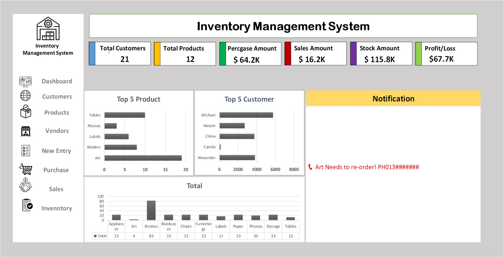

# Inventory Management System (Excel)

*A self-built Excel system that records purchases and sales, tracks stock levels and shows the key numbers on one dashboard.*

## Overview

This project is an inventory management system built in Microsoft Excel (May 2026 – June 2026). It records purchases and sales, tracks stock for each product, and shows KPIs, charts and a low-stock alert on one dashboard.

> **Note:** All data in this project is **sample data I created myself** (fictional customers and vendors). It is used only to demonstrate how the system works.

## Key Metrics

Numbers shown on the dashboard:

| Metric | Value |
|---|---|
| Customers | 21 |
| Product categories | 11 |
| Total purchase | \$64.2K |
| Total sales | \$16.2K |
| Stock value | \$115.8K [valued at cost or sale price?] |
| Profit/Loss | \$67.7K [explain formula] |

## How It Works

1. **Master data:** Customers, Products and Vendors sheets. Vendors are grouped by city, state and region ([number of vendors]).
2. **Data entry:** Purchase and Sales entries are added from the New Entry page.
3. **Stock tracking:** The Inventory sheet tracks the stock level of each product. [formula used]
4. **Dashboard:** KPIs, charts and a low-stock alert are built from these sheets.

## Low-Stock Alert

When a product's stock falls below [threshold], the dashboard shows an alert with the vendor's details. In the sample data, Art has 4 units left and shows the message "Art Needs to re-order!".

## Key Insights

From the sample data:

- Art leads the Top 5 Product chart with 19 units sold.
- Michael (\$5,745.47) and Alexander (\$3,830.31) are among the highest-value customers.
- Art also has only 4 units left in stock, so it triggers the re-order alert.
- [add 1–2 more insights you found in the data]

## Tools

- Microsoft Excel: [list the Excel functions/features you used]

## Files

| File | Description |
|---|---|
| `Inventory_Management_System_20260610_V01.xlsx` | Excel workbook with all sheets and the dashboard |
| `Inventory_Management_Dashboard_Overview_20260616_V01.jpeg` | Dashboard screenshot |
| `Inventory_Management_System_Screenshots_20260616_V01.pdf` | PDF copy of the system |

## Author

**Shanto Islam** – Data Analyst

- GitHub: [shanto-islam-analytics](https://github.com/shanto-islam-analytics)
- LinkedIn: https://www.linkedin.com/in/shanto85206
